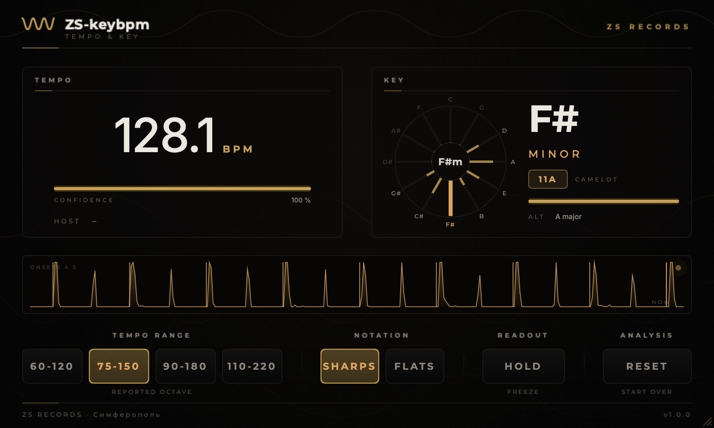

# ZS-keybpm

Измерительный плагин студии **ZS Records**: темп и тональность по самому материалу.
Сигнал проходит через плагин нетронутым — это прибор, а не обработка.

- **TEMPO** — темп, посчитанный по звуку, а не взятый у хоста. Рядом строка HOST
  с темпом проекта и расхождением: луп или сэмпл проверяется, не считая на слух.
- **KEY** — тональность по накопленной хроме, с кодом Camelot для сведения и со
  вторым кандидатом. Почти все ошибки определения тональности — это параллельная
  или одноимённая, и честнее назвать обе, чем выдать одну с видом уверенности.
- **ONSETS** — четыре секунды функции атак, из которой посчитан темп, и найденная
  сетка бита поверх. Риски стоят на пиках — значит темп верный; это то, чем
  показание отличается от обещания.

VST3 · AU · Standalone, macOS (universal: Apple Silicon + Intel) и Windows x64.



---

## Установка

Готовые установщики — брендированные, ставят всё в системные папки плагинов:

| | |
|---|---|
| macOS | `dist/ZS-keybpm-<версия>.pkg` — VST3, AU и приложение, каждый отдельной галочкой |
| Windows | `dist/ZS-keybpm-<версия>-Windows-x64.exe` — VST3 в общую папку `Common Files\VST3` |

Собрать установщик для macOS:

```bash
./scripts/package-macos.sh
```

Пакет не подписан, поэтому при первом открытии Gatekeeper предупредит — правый
клик по `.pkg` → **Открыть**. Если есть сертификаты Apple Developer, подпись
подхватывается из окружения:

```bash
ZS_APP_ID="Developer ID Application: … (TEAMID)" \
ZS_INSTALLER_ID="Developer ID Installer: … (TEAMID)" \
./scripts/package-macos.sh
```

Установщик для Windows собирает CI (см. ниже) либо Inno Setup 6 вручную:

```bat
iscc /DVersion=1.0.0 /DSourceDir=..\..\dist\vst3 Installer\windows\ZS-keybpm.iss
```

---

## Сборка из исходников

```bash
./scripts/build.sh
```

Скрипт при необходимости сам склонирует JUCE, соберёт универсальный релиз и
положит плагин в

```
~/Library/Audio/Plug-Ins/VST3/ZS-keybpm.vst3
~/Library/Audio/Plug-Ins/Components/ZS-keybpm.component
```

Со встроенными офлайн-проверками DSP:

```bash
./scripts/build.sh --tests
```

Удалить:

```bash
./scripts/uninstall.sh
```

Требуется CMake 3.22+ и Xcode Command Line Tools.

### Windows (VST3)

JUCE 9 не собирается компилятором MinGW (фреймворк запрещает это намеренно),
поэтому кросс-сборка с Mac невозможна — Windows-версию собирает MSVC. Это делает
CI: [`.github/workflows/windows.yml`](.github/workflows/windows.yml) на каждый push
в `main` собирает VST3 на `windows-latest`, прогоняет DSP-тесты, собирает
установщик Inno Setup и кладёт всё в артефакты.

Забрать: вкладка **Actions** → последний зелёный запуск **Windows VST3** →
артефакты **ZS-keybpm-VST3-Windows-x64** и **ZS-keybpm-Installer-Windows-x64**.

Собрать вручную на Windows-машине с Visual Studio 2022:

```bat
git clone --depth 1 --branch master https://github.com/juce-framework/JUCE.git JUCE
cmake -B build -G "Visual Studio 17 2022" -A x64 -DZSKEYBPM_COPY_AFTER_BUILD=OFF
cmake --build build --config Release --target ZSkeybpm_VST3
```

---

## Как оно устроено

Определение темпа и тональности — не работа звукового потока: автокорреляция по
десяти секундам атак и FFT на 4096 точек не имеют отношения к дедлайну в
микросекундах. Поэтому звуковой поток делает ровно одно — кладёт моно-микс в
lock-free очередь, а всё остальное происходит на отдельном потоке анализа, который
публикует снимок для интерфейса.

Весь анализ идёт на одной внутренней частоте (11 025 Гц), к которой приводится
любая сессия. Независимость от частоты дискретизации покупается один раз, в
`Decimator`, вместо того чтобы оплачиваться в каждой формуле.

```
Source/
  PluginProcessor.*     проброс звука + чтение темпа хоста
  PluginEditor.*        один таймер кормит все показания одним снимком
  Parameters.h          три параметра: range, notation, hold
  KeyNames.h            имена тональностей и коды Camelot
  dsp/
    AnalysisConfig.h    все константы анализа, без JUCE — их видят и тесты
    AnalysisFeed.h      lock-free мост «звуковой поток → анализ»
    Decimator.*         Butterworth 8-го порядка + Lagrange к 11 025 Гц
    TempoTracker.*      спектральный флюкс → гребенчатая автокорреляция → гистограмма
    KeyTracker.*        хрома по спектральным пикам → 24 профиля Shaath
    AnalysisEngine.*    поток анализа и публикация снимка
  gui/                  Theme, ZsLookAndFeel, BrandBackground + пять виджетов
Tests/DspTests.cpp      офлайн-проверки на синтетическом материале
Tools/RenderArt.cpp     вся брендовая графика рисуется тем же кодом, что и плагин
```

### Три вещи, которые обычно ломают такие плагины

**Двойной темп.** Обычная автокорреляция одинаково радуется и периоду бита, и его
половине — восьмые в хэте превращают 128 в 256. Здесь каждый кандидат оценивается
вместе с тремя своими кратными: выигрывает тот период, у которого присутствует весь
гармонический ряд, а это бит, а не его дробление.

**Дёргающееся показание.** Оценка не показывается напрямую: каждые полсекунды она
кладётся в затухающую гистограмму с весом своей уверенности, а на экране —
центроид выигравшего кластера. Одно неудачное окно больше не двигает цифру, а
уверенность — это буквально доля всех накопленных данных, согласная с показанием.

**Каша в хроме.** Если складывать в полутона все бины FFT, хэт разольётся ровным
слоем по всем двенадцати классам. Считаются только локальные пики спектра — каждый
уточняется параболической интерполяцией и взвешивается тем, насколько точно он
попал в полутон. Широкополосная перкуссия даёт мало резких пиков и почти не влияет.

### Проверка глазами, а не на веру

`Tools/RenderArt.cpp` гоняет синтетический материал через настоящий процессор,
даёт поработать настоящему потоку анализа и снимает настоящий редактор в PNG:

```bash
cmake -B build-dev -DCMAKE_BUILD_TYPE=Release -DZSKEYBPM_BUILD_ART=ON
cmake --build build-dev --target ZSkeybpmArt
./build-dev/ZSkeybpmArt_artefacts/Release/ZSkeybpmArt ui shot.png
```

Без `CMAKE_BUILD_TYPE` путь будет другим: JUCE кладёт артефакты в
`<цель>_artefacts/$<CONFIG>`, а у одноконфигурационного генератора без типа сборки
`CONFIG` пустой.

Тем же инструментом рисуется графика установщиков — палитра, шрифты и волновой знак
берутся из `gui/Theme`, поэтому установщик и интерфейс не могут разъехаться. Всё
сразу перерисовывается одной командой:

```bash
./scripts/brand-art.sh
```

---

## Лицензия

AGPLv3 — см. [LICENSE](LICENSE). Установщики кладут копию рядом с плагином — на
macOS в `/Library/Application Support/ZS Records/ZS-keybpm`, на Windows в
`C:\Program Files\ZS Records\ZS-keybpm` вместе с деинсталлятором. AGPLv3 требует,
чтобы текст лицензии шёл с бинарником, а не только ссылкой.

**Сторонние компоненты:**

- **JUCE 9** — двойное лицензирование, здесь используется вариант AGPLv3.
- **Montserrat** и **Inter** — SIL Open Font License 1.1; шрифты вкомпилированы в
  бинарник, текст лицензии и копирайты — в
  [`Resources/Fonts`](Resources/Fonts/README.md).
- **Профили тональностей** — веса Ибрагима Шаата (Shaath), опубликованные вместе с
  KeyFinder.

ZS RECORDS · Симферополь · [zsr.artspace1977.ru](https://zsr.artspace1977.ru)
